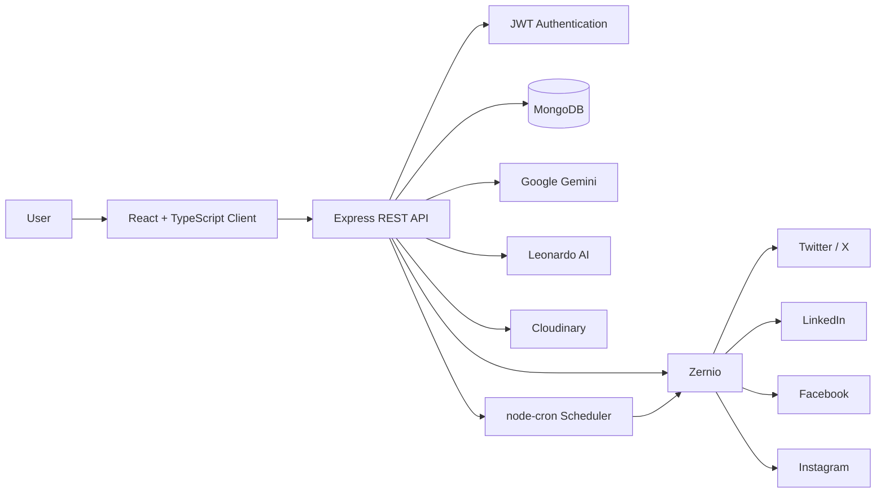

# 🚀 PostPilot

> **AI-powered social media content creation, scheduling, and publishing — from one workspace.**

PostPilot is a full-stack social media automation platform that helps you go from **idea → AI-generated content → scheduled post → automatic publishing** without jumping between multiple platforms.

Create captions with AI, optionally generate a matching image, connect your social accounts, schedule posts, and track publishing activity from a single dashboard.

---

## ✨ What Can PostPilot Do?

| Feature | What it does |
|---|---|
| 🤖 **AI Content Composer** | Generate social posts from a simple prompt with selectable tones |
| 🖼️ **AI Image Generation** | Generate a complementary image for AI-created posts |
| 📅 **Smart Scheduling** | Schedule posts for a specific date and time |
| 🌐 **Multi-Platform Publishing** | Manage Twitter/X, LinkedIn, Facebook, and Instagram |
| 🔗 **Social Account Connections** | Connect accounts through OAuth-powered integrations |
| ⚡ **Automatic Publishing** | Background scheduler publishes due posts automatically |
| 📊 **Activity Dashboard** | See scheduled posts, published posts, connected accounts, and recent activity |
| 🖼️ **Media Uploads** | Upload images/videos and persist media through Cloudinary |
| 🔐 **Authentication** | User registration, login, JWT authentication, and protected API routes |

---

## 🎯 The Idea

Managing social media manually usually means:

```text
Create content
     ↓
Choose platform
     ↓
Upload media
     ↓
Schedule
     ↓
Remember to publish
     ↓
Repeat for every platform
```

PostPilot turns that into:

```text
        💡 Idea / Prompt
               ↓
        🤖 AI Content
               ↓
       🖼️ Optional Image
               ↓
       🌐 Select Platforms
               ↓
        📅 Pick Date & Time
               ↓
          🚀 PostPilot
               ↓
     ┌─────────┼─────────┐
     ↓         ↓         ↓
   LinkedIn   X       Instagram
               ↓
        📊 Activity Log
```

---

## 🧠 AI Content Generation

PostPilot uses **Google Gemini** to transform a prompt into social-ready content.

You can choose from different tones:

- Professional
- Creative
- Funny
- Minimalist
- Excited

The AI is also instructed to generate relevant hashtags and an image prompt.

When image generation is enabled, PostPilot uses **Leonardo AI** to create a visual based on the generated image prompt, then stores the generated asset in **Cloudinary**.

### Example

**Prompt**

> Launching our new AI-powered productivity app

**Tone**

> Excited

**PostPilot generates**

```text
🚀 Something new is here!

We're excited to introduce our AI-powered productivity app,
built to help you work smarter and spend less time on repetitive tasks.

#AI #Productivity #Automation #Technology
```

and can generate a complementary image for the post.

---

## 📅 Scheduling & Automatic Publishing

Posts can be scheduled for a specific date and time.

A server-side cron job checks for posts that are due every minute:

```text
Scheduled Post
      ↓
node-cron checks every minute
      ↓
Is scheduledFor <= current time?
      ↓
     Yes
      ↓
Find connected social accounts
      ↓
Send post through Zernio
      ↓
Publish to selected platforms
      ↓
Mark post as "published"
      ↓
Create activity log
```

If publishing fails, the post is marked as:

```text
failed
```

This keeps the scheduling workflow asynchronous instead of requiring the user to keep the browser open.

---

## 🌐 Supported Platforms

PostPilot currently supports:

- 𝕏 **Twitter / X**
- 💼 **LinkedIn**
- 📘 **Facebook**
- 📸 **Instagram**

Social account connections and publishing are handled through the **Zernio API integration**.

---

## 🏗️ Architecture



---

## 🛠️ Tech Stack

### Frontend

- ⚛️ **React 19**
- 🟦 **TypeScript**
- ⚡ **Vite**
- 🎨 **Tailwind CSS**
- 🧭 **React Router**
- 🔌 **Axios**
- 🔔 **React Hot Toast**
- 🧩 **Lucide React**
- 🌐 **Simple Icons**

### Backend

- 🟢 **Node.js**
- 🚂 **Express 5**
- 🟦 **TypeScript**
- 🍃 **MongoDB + Mongoose**
- 🔐 **JWT**
- 🔒 **bcrypt**
- ⏰ **node-cron**
- 📤 **Multer**

### AI & Integrations

- ✨ **Google Gemini**
- 🎨 **Leonardo AI**
- ☁️ **Cloudinary**
- 📣 **Zernio**
- 🔗 OAuth-based social account connections

---

## 📁 Project Structure

```text
PostPilot/
│
├── client/
│   ├── public/
│   └── src/
│       ├── api/
│       │   └── axios.ts
│       │
│       ├── assets/
│       │
│       ├── components/
│       │   ├── Home/
│       │   ├── AccountList.tsx
│       │   ├── Layout.tsx
│       │   ├── PlatformPickerModal.tsx
│       │   └── Sidebar.tsx
│       │
│       ├── context/
│       │   └── AuthContext.tsx
│       │
│       ├── pages/
│       │   ├── Accounts.tsx
│       │   ├── AIComposer.tsx
│       │   ├── Dashboard.tsx
│       │   ├── Home.tsx
│       │   ├── Login.tsx
│       │   └── Scheduler.tsx
│       │
│       ├── App.tsx
│       └── main.tsx
│
├── server/
│   ├── config/
│   │   ├── cloudinary.ts
│   │   ├── db.ts
│   │   ├── multer.ts
│   │   └── zernio.ts
│   │
│   ├── controllers/
│   │   ├── accountControllers.ts
│   │   ├── activityController.ts
│   │   ├── authController.ts
│   │   ├── postController.ts
│   │   └── socialAuthController.ts
│   │
│   ├── middlewares/
│   │   └── authMiddlewware.ts
│   │
│   ├── models/
│   │   ├── Account.ts
│   │   ├── ActivityLog.ts
│   │   ├── Generation.ts
│   │   ├── Post.ts
│   │   └── User.ts
│   │
│   ├── routes/
│   │   ├── accountRoutes.ts
│   │   ├── activityRoutes.ts
│   │   ├── authRoutes.ts
│   │   ├── postRoutes.ts
│   │   └── socialAuthRoutes.ts
│   │
│   ├── services/
│   │   └── schedulerService.ts
│   │
│   └── server.ts
│
├── .gitignore
└── README.md
```

---

## 🔐 Authentication Flow

PostPilot uses JWT-based authentication.

```text
Register / Login
       ↓
bcrypt password hashing
       ↓
JWT generated
       ↓
Client stores authentication state
       ↓
Protected API requests
       ↓
JWT middleware validates user
       ↓
Access user-specific data
```

Each user's posts, connected accounts, generations, and activity are scoped to their authenticated user.

---

## ⚙️ Getting Started

### Prerequisites

Make sure you have:

- **Node.js 18+**
- **MongoDB**
- A **Google Gemini API key**
- A **Zernio API key**
- A **Cloudinary account**
- A **Leonardo AI API key** if image generation is enabled

---

## 1️⃣ Clone the repository

```bash
git clone https://github.com/YOUR_USERNAME/postPilot.git
cd postPilot
```

---

## 2️⃣ Install frontend dependencies

```bash
cd client
npm install
```

Create:

```text
client/.env
```

Add:

```env
VITE_API_BASE_URL=http://localhost:3000
```

---

## 3️⃣ Install backend dependencies

```bash
cd ../server
npm install
```

Create:

```text
server/.env
```

Add:

```env
MONGODB_URI=your_mongodb_connection_string
JWT_SECRET=your_jwt_secret

ZERNIO_API_KEY=your_zernio_api_key

GEMINI_API_KEY=your_gemini_api_key
LEONARDO_API_KEY=your_leonardo_api_key

CLOUDINARY_CLOUD_NAME=your_cloudinary_cloud_name
CLOUDINARY_API_KEY=your_cloudinary_api_key
CLOUDINARY_API_SECRET=your_cloudinary_api_secret
```

> ⚠️ **Never commit `.env` files or API keys to GitHub.**

---

## 4️⃣ Start the backend

From the `server` directory:

```bash
npm run start
```

For development with automatic restarts:

```bash
npm run server
```

The API runs on:

```text
http://localhost:3000
```

---

## 5️⃣ Start the frontend

Open another terminal:

```bash
cd client
npm run dev
```

Vite will provide a local URL, usually:

```text
http://localhost:5173
```

Open it in your browser and start using PostPilot.

---

## 🔌 API Overview

### Authentication

```text
POST /api/auth/register
POST /api/auth/login
```

### Social Accounts

```text
GET    /api/accounts
DELETE /api/accounts/:id

GET /api/oauth/:platform/url
GET /api/oauth/sync
```

### Posts

```text
GET  /api/posts
GET  /api/posts/generations
POST /api/posts
POST /api/posts/generate
```

### Activity

```text
GET /api/activity
```

---

## 📸 Screenshots

Add your application screenshots here once the UI is deployed:

```markdown


```

Recommended screenshots:

- Dashboard
- AI Composer
- Account Connections
- Scheduler
- Landing Page

---

## 🚀 Live Demo

🔗 **[Try PostPilot Live](YOUR_LIVE_DEMO_URL)**

> Replace `YOUR_LIVE_DEMO_URL` with the deployed frontend URL when the project is live.

---

## 💡 Why PostPilot?

PostPilot was designed around a simple idea:

> **Creating content should be creative. Managing it should be automated.**

Instead of manually writing, formatting, uploading, and publishing the same content across multiple platforms, PostPilot provides a single workflow for the entire process.

---

## 🔮 Future Improvements

Some natural next steps for the platform:

- 📈 Detailed engagement analytics
- 🧠 Brand voice / custom AI personas
- 🗓️ Content calendar with drag-and-drop scheduling
- 🔁 Recurring posts
- 👥 Team workspaces and role-based permissions
- 📊 Platform-specific performance reports
- 🧪 A/B testing for AI-generated content
- 🔔 Publishing and scheduling notifications
- 🧵 Thread generation for X
- 📝 LinkedIn-specific content optimization
- 📱 Mobile-friendly publishing workflow

---

## 🧑‍💻 Project

**PostPilot** — AI-powered social media automation platform.

Built with React, TypeScript, Node.js, MongoDB, Gemini, Leonardo AI, Cloudinary, and Zernio.

---

<p align="center">
  <strong>💡 Create once. Schedule smart. Publish everywhere.</strong>
</p>
